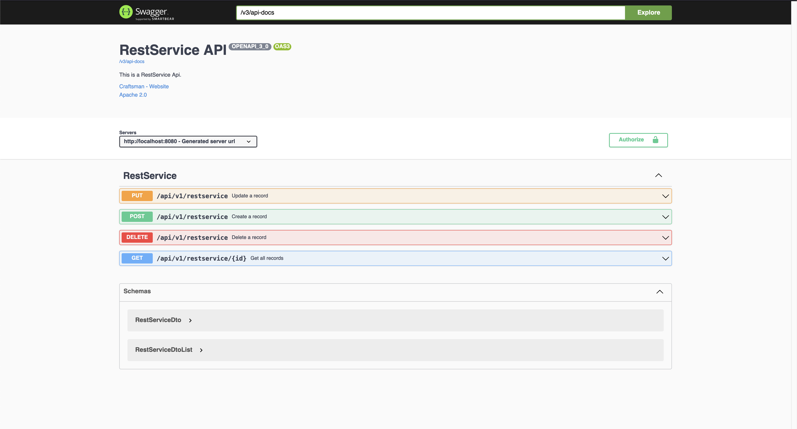
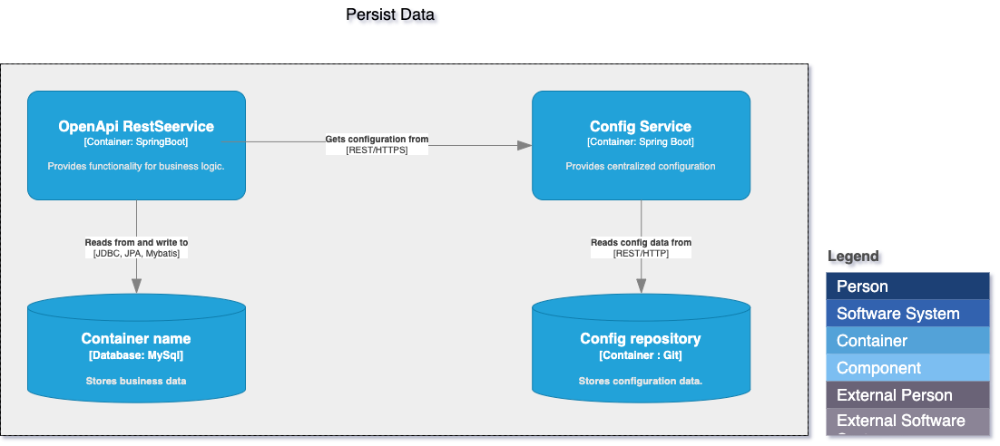

= Spring Native Backend Openapi Archetype 

=== Description

Maven archetype with spring native for develop services with open api REST, generate native image and deploy in cloud environment.

=== RestService OpenApi

For access to the  swagger ui  click on http://localhost:8080[RestServiceApi,role=external, window=_blank]

.Springnative RestService OpenApi


=== Persist Data Integration

The image describe the persist data layer of this archetype, all properties are in a git central repository. 
The archetypes gets the configuration from the config service by REST/HTTP.

.Persistent Data Integration



=== Technologies Used

The framework and technology used for this archetype is describe in next table with name and version.

.Tools and frameworks with version
|===
|Name | Version | Description

|Java
|17
|Programing Language

|Springboot
|2.7.5
|Spring Boot makes it easy to create stand-alone, production-grade Spring based Applications

|Springnative
|0.12.1
|It is a spring base technology that in addition to the regular Java Virtual Machine supported by Spring since its inception, has the support for compiling Spring applications to native images with GraalVM

|Graalvm
|22.3.0
|Graalvm is a high-performance, polyglot, virtual machine for running programs in different languages. It supports JVM-based languages such as Java, Scala, and Kotlin and also JavaScript, etc.

|Springdoc
|1.6.12
|It is a library uses spring-boot application auto-configured packages to scan for the following annotations in spring beans: OpenAPIDefinition and Info.

|Lombok
|1.8.2
|It is a java library that automatically plugs into your editor and build tools, spicing up your java.

|Mapstruct
|1.4.2.Final
|It is a multi-layered tool for mapping between different object models.
|===

=== Technical

Next section describe how to use the archetype after download the source code from repository.

=== Installation

```bash
    $ git clone https://github.com/cadb-craftsman/archetypes-springboot-2.X.git
    $ cd springnative-backend-openapi-jpa
    $ mvn -X clean archetype:create-from-project -Darchetype.properties=./archetype.properties
```

=== Setup

Go to dir `./target/generated-sources/` then executes the next maven command.

```bash
    $ mvn -X install
```

After that you can creates a new project based in this archetype.

=== Native Image

For generating a spring native image with this archetype only needs execute the next maven command.

```bash
    $ mvn -X -Pnative clean spring-boot:build-image 
```

=== Contribute

Pull requests are welcome. For significant changes, please open an issue first to discuss what you would like to change.
Please make sure to update the tests as appropriate.

=== Acknowledgment

* Author http://cadb-craftsman.com[Carlos Diaz,role=external, window=_blank]

=== License

* Apache License 2.0